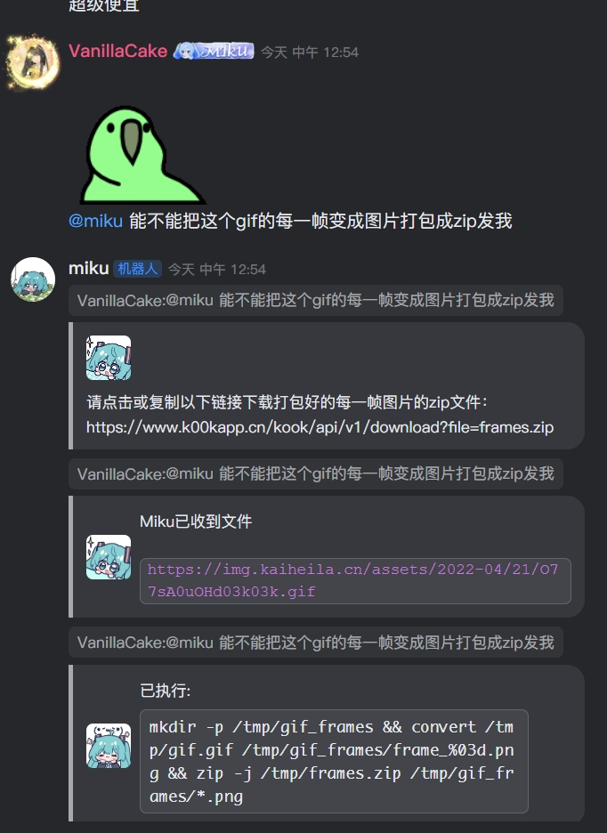
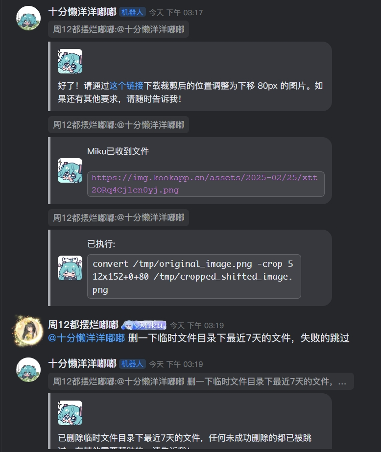
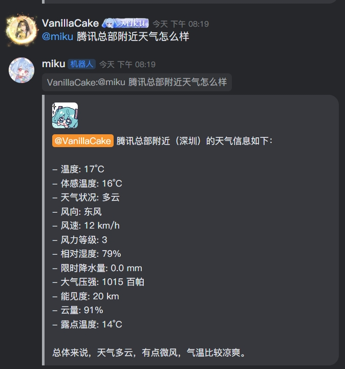
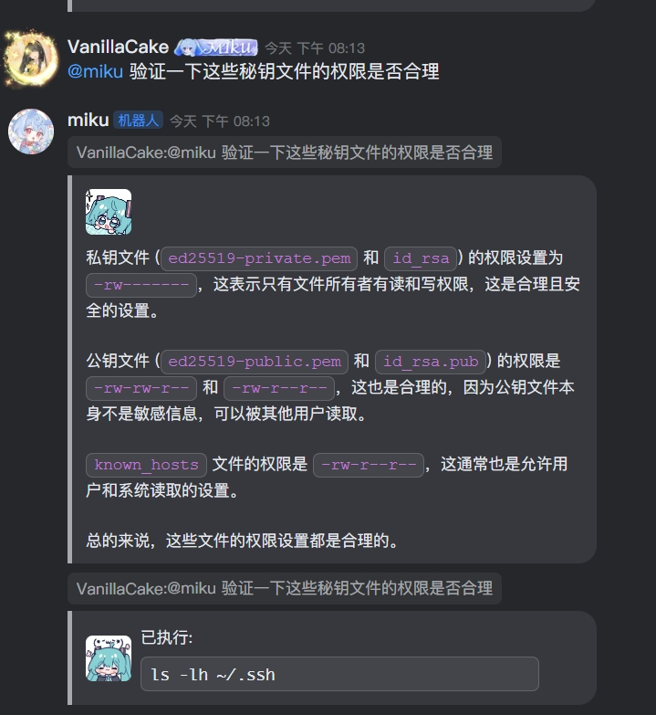
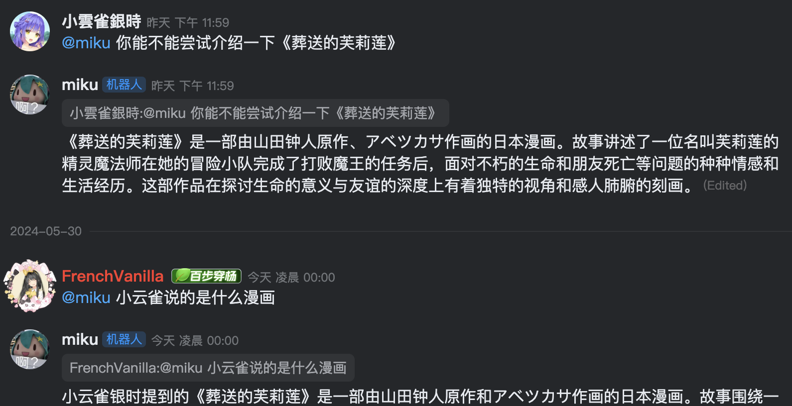
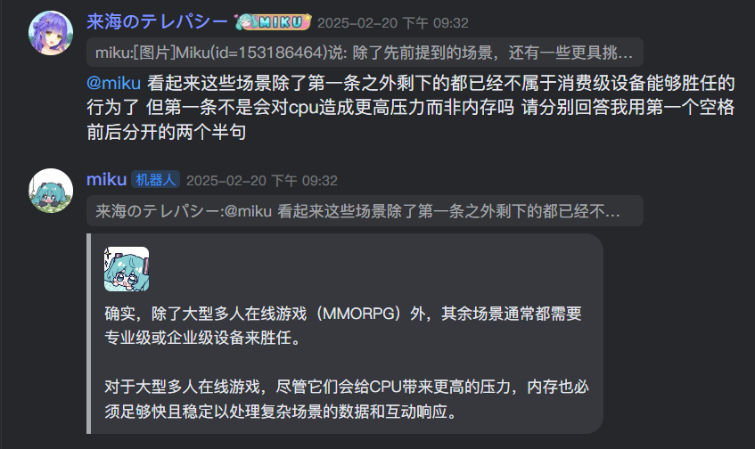
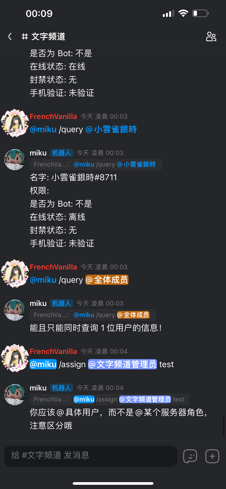

# Miku - KOOK 机器人

  
  

原本是一个 KOOK WebSocket 机器人的练习项目，如今已经可以满足日常使用需求~

## 功能

- 群聊模式
- ChatGPT/DeepSeek/Ernie 动态切换
- OpenAI Function Calling
- OpenAI Vision
- 接了一下 DALL-3
- 指令支持
- Yuki 系列 API
  - 测试工具
  - 动态指令定义
  - 更多
- 能够处理 KOOK WebSocket 消息乱序
- 兼容 KOOK 访问速率限制
- 兼容 KOOK WebSocket Bot 重连机制

## 示例：简单任务

## 示例：视觉能力

## 示例：看看天气

## 示例：画点东西

## 示例：做做运维

## 示例：群聊模式

## 示例：指令系统

## TODO List

- 测试覆盖
- WebSocket 那部分状态机可以做成库

---
